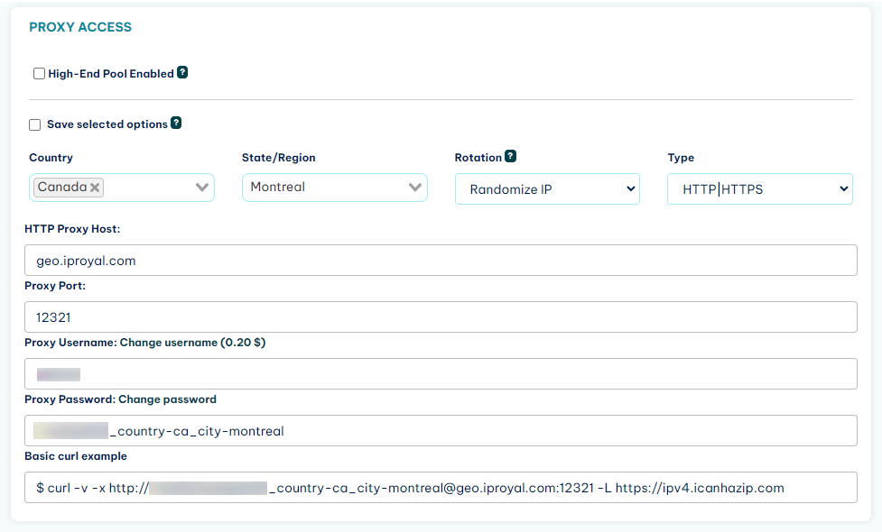

# Web Scraping With Rust - The Ultimate 2025 Guide

While Python might be the most popular language for web scraping, you can do basic web scraping tasks with any language you’re proficient with. As long as the language has basic library support for getting HTML and parsing its contents, you’re good to go.

For example, Rust is one of the most popular new languages. While it’s used for many backend tasks, not many people suggest it for web scraping.

However, web scraping with Rust is as easy as [with Python](https://iproyal.com/blog/python-web-scraping-step-by-step-guide/). Its web scraping libraries follow the same principles as the Python ones, and the resulting code is as simple to read as Python.

In this article, you’ll learn how to do web scraping with Rust. You’ll also discover how you can use two Rust libraries - [Reqwest](https://docs.rs/reqwest/latest/reqwest/) and [Scraper](https://docs.rs/scraper/latest/scraper/) - to get the list of top posts of Hacker News together with their point counts.

## How to Scrape Hacker News With Rust

In this guide, you’ll learn how to scrape the top posts of Hacker News with Rust. You’ll create a program that downloads the front page of Hacker News and also prints all the posts together with their scores.

## Setup

For this tutorial, you’ll need to have the Rust compiler installed on your machine. You can download it from the official website if you don’t have it yet.

First, you’ll need to create a new Rust project by running cargo new web_scraper in the command line. After that, open the newly created directory in your code editor of choice.

For this project, you’ll need to add three dependencies:

* Reqwest for handling HTTP requests
* Scraper for parsing the HTML of the page
* Tokio (Rust’s async runtime), which is needed to use Reqwest.

* Open the Cargo.toml file and update it with the dependencies:

```toml
[package]
name = "scraper-example"
version = "0.1.0"
edition = "2024"

[dependencies]
reqwest = "0.11"
scraper = "0.13.0"
tokio = { version = "1.22.0", features = ["full"] }
```

Example of this file can be found [here](examples/boilerplate-example/Cargo.toml)

Now run the following command to install dependencies.

ℹ️ Important: you will need to have [rust installed](https://rust-lang.org/tools/install/)

```shell
cargo build
```

Then, open main.rs and replace the boilerplate there with the following: 

```rust
#[tokio::main]
async fn main() -> Result<(), Box<dyn std::error::Error>> {

// code goes here

    Ok(())
}
```

This is the minimal code you need to use the [Tokio runtime](https://tokio.rs/), which the Reqwest library uses by default. Once you have this all set up, you can start writing “real code.”

If you struggle to get started, [here's](examples/boilerplate-example/src/main.rs) an example boilerplate project that you can use.

## Getting a Page With Reqwest

[Reqwest](https://docs.rs/reqwest/latest/reqwest/) is a HTTP client library that lets you send GET, POST, and other HTTP requests to servers. It’s Rust’s equivalent to [Python’s requests library](https://iproyal.com/blog/python-requests-library/).

To use it, you first need to create a new client, which the library will use as the contact point with the site.

```rust
let client = reqwest::Client::builder().build()?;
```

After that, you can use this client to send a GET request. The code below will fetch the site's HTML code and store it in a response variable.

```rust
let response = client
        .get("https://news.ycombinator.com/")
        .send()
        .await?
        .text()
        .await?;
```

That’s all you need to do to fetch the contents of a web page with Rust. Here’s the code up to this point.

```rust
#[tokio::main]
async fn main() -> Result<(), Box<dyn std::error::Error>> {
    let client = reqwest::Client::builder().build()?;

    let response = client
        .get("https://news.ycombinator.com/")
        .send()
        .await?
        .text()
        .await?;

    Ok(())
}
```

Now you can parse the downloaded web page to find the information you need.

## Parsing a Page With Scraper

[Scraper](https://docs.rs/scraper/latest/scraper/) is a Rust library for parsing HTML and querying it with CSS selectors. It’s Rust’s version of [BeautifulSoup](https://iproyal.com/blog/web-scraping-in-python-using-beautiful-soup/).

To use it, you first need to parse the entire HTML of the response.

```rust
let document = scraper::Html::parse_document(&response);
```

Then you can use selectors to query this document for items that you need.

Selectors are created using the `scraper::Selector::parse` method. This method takes as an argument a string with a [CSS selector](https://www.w3schools.com/cssref/css_selectors.php), which is a common way of specifying CSS elements in fine detail.

If you inspect the HTML code of Hacker News, you’ll see that post titles are wrapped in a span element with the class of titleline. To get the title that’s inside that span element, you need to select the anchor element inside. This is covered by the following CSS selector: span.titleline>a.

Here’s the function to create that selector in Rust.

```rust
let title_selector = scraper::Selector::parse("span.titleline>a").unwrap();
```

Since all strings are not valid CSS selectors, the parse function returns a [Result](https://serokell.io/blog/enums-and-pattern-matching#option-and-result-enums) type. In this case, it’s fine for the program to crash if the CSS selector is not formed correctly, so you’ll just call [unwrap()](https://serokell.io/blog/enums-and-pattern-matching#unwrap) to get the selector.

Afterward, you can get all post titles by applying the selector to the HTML document and then mapping each matching element to its inner HTML (which is the title text).

```rust
let titles = document.select(&title_selector).map(|x| x.inner_html());
```

Getting the point counts of each title is a bit more difficult. This is mainly because a title is not required to actually have a point count: some sponsored messages will only have the posting time.

First, you’ll need to identify an element common to all posts: those with scores and those without them. In this case, it’s a table cell with the subtext class that contains all the information, such as the user who submitted the post, time posted, and post’s score.

```html
<td class="subtext">
...
</td>
```

Using the previously covered selector syntax, you’ll select all of these elements.

```rust
let subtext_selector = scraper::Selector::parse("td.subtext").unwrap();
let subtexts = document.select(&subtext_selector);
```

After that, you need to go through these elements, check if there is a score in the element. If there isn’t, substitute it with a default.

First, you’ll need a selector for scores.

```rust
let score_selector = scraper::Selector::parse("span.score").unwrap();

Then, you’ll need to iterate over the subtext elements and find the scores. 

    let scores = subtexts.map(|subtext| {
        subtext
            .select(&score_selector)
            .next()
            .and_then(|score| score.text().nth(0))
            .unwrap_or("0 points")
    });
```

If the score is not there, the function above will use .unwrap_or() to insert a default of “0 points”.

That’s all you need for web scraping with Rust! Now, you can print the titles and scores out in the console.

```rust
titles.zip(scores).for_each(|pair| println! {"{:?}", pair});
```

Here’s the full code:


```rust
#[tokio::main]
async fn main() -> Result<(), Box<dyn std::error::Error>> {
    let client = reqwest::Client::builder().build()?;

    let response = client
        .get("https://news.ycombinator.com/")
        .send()
        .await?
        .text()
        .await?;

    let document = scraper::Html::parse_document(&response);

    let title_selector = scraper::Selector::parse("span.titleline>a").unwrap();
    let titles = document.select(&title_selector).map(|x| x.inner_html());

    let subtext_selector = scraper::Selector::parse("td.subtext").unwrap();
    let subtexts = document.select(&subtext_selector);

    let score_selector = scraper::Selector::parse("span.score").unwrap();

    let scores = subtexts.map(|subtext| {
        subtext
            .select(&score_selector)
            .next()
            .and_then(|score| score.text().nth(0))
            .unwrap_or("0 points")
    });

    titles.zip(scores).for_each(|pair| println! {"{:?}", pair});
    Ok(())
}
```

You can run this program by calling `cargo run` in the command line. It should print out 30 title-and-score pairs like these:

```shell
("Apple's reaction to protests: AirDrop is now limited to 10 minutes", "382 points")
("Intentionally Making Close Friends", "410 points")
("Curation and decentralization is better than millions of apps", "163 points")
("Everything I wish I knew when learning C", "470 points")
("How hospice became a for profit hustle", "117 points")
...
```

If you get stuck, you can always find a working example [here](examples/news-scraping-example/src/main.rs).

## Adding a Proxy to Reqwest

When you’re scraping web pages, it’s a good idea to hide your IP address so that scraping activities wouldn’t be detected and suspended by site admins.

The main way to do this is via proxies, which serve as an intermediary between you and the target site and mask your IP address.

In this part of the tutorial, you’ll learn how to add a proxy to your Rust web scraping program.

This tutorial will use [IPRoyal residential proxies](https://iproyal.com/residential-proxies/) as an example. They are great for [web scraping projects](https://iproyal.com/blog/web-scraping-with-javascript-and-node-js-without-getting-blocked/) with Node js because they rotate your IP on every request you make. In addition, they are sourced from a diverse set of locations, which makes any scraping activity hard to detect.

But if you use any other proxy provider, don’t worry—the process should be very similar.

First, you need the link to your proxy. If you’re using IPRoyal proxies, you can find the link in your dashboard.



This link needs to be added to your client as a proxy for HTTP and HTTPS requests. You can do this in the first part of the program where you define and build your client.

```rust
let client = reqwest::Client::builder()
        .proxy(reqwest::Proxy::http(
            "http://link-to-proxy",
        )?)
        .proxy(reqwest::Proxy::https(
            "http://link-to-proxy",
        )?)
        .build()?;
```

An example of a working file can be found [here](examples/proxy-example/src/main.rs)

Now, requests you send with this client will pass through the proxy and not reveal your real IP address.

## Final Thoughts

In this article, you learned how to accomplish basic web scraping tasks with the Rust programming language, as well as how to add a proxy to a web scraper written in Rust.

If you want to scrape more advanced pages that use JavaScript, the simple combination of Reqwest and Scraper might not be enough. Just like Python, Rust also has a library for Selenium bindings called [Thirtyfour](https://docs.rs/thirtyfour/latest/thirtyfour/). It enables you to simulate the actions of a real browser, such as clicking, typing, scrolling, and many more.

## FAQ

### What is Tokio, and why do you need it for web scraping?

Tokio is Rust’s runtime for creating asynchronous applications. This is useful in web scraping applications that make a lot of requests like web crawlers or scraping jobs that cover a lot of pages. This is so because in synchronous applications, an HTTP request would block the execution of other code, while it’s not the case with async apps: the app can work on other items while waiting for the response.

Reqwest uses Tokio by default, but it’s possible to use the [blocking API](https://docs.rs/reqwest/latest/reqwest/blocking/) for simple tasks.

### Why is the unwrap() function used so frequently in example code?

Rust likes to avoid runtime panics - situations where the code crashes during execution because there is some error - as much as it can.

So functions that could result in an exception in languages like Python sometimes return a value of the [Result type](https://doc.rust-lang.org/std/result/), which is a value that can be either a valid result or an error. You can either choose to handle the error in some way, or just call unwrap(), which will crash the program in case of an error.

For errors that cannot be recovered from like a wrongly constructed selector, this is a good enough option.

### Can you use XPath selectors in Scraper?

Unfortunately, Scraper doesn’t support [XPath expressions](https://www.w3schools.com/xml/xpath_syntax.asp). If you need them for your scraping project, you can use the [Thirtyfour](https://docs.rs/thirtyfour/latest/thirtyfour/) library, which provides XPath selectors, among other things. Do take in mind that it’s a Selenium library (meaning it simulates a web browser), which comes with extra complexity for scraping.
